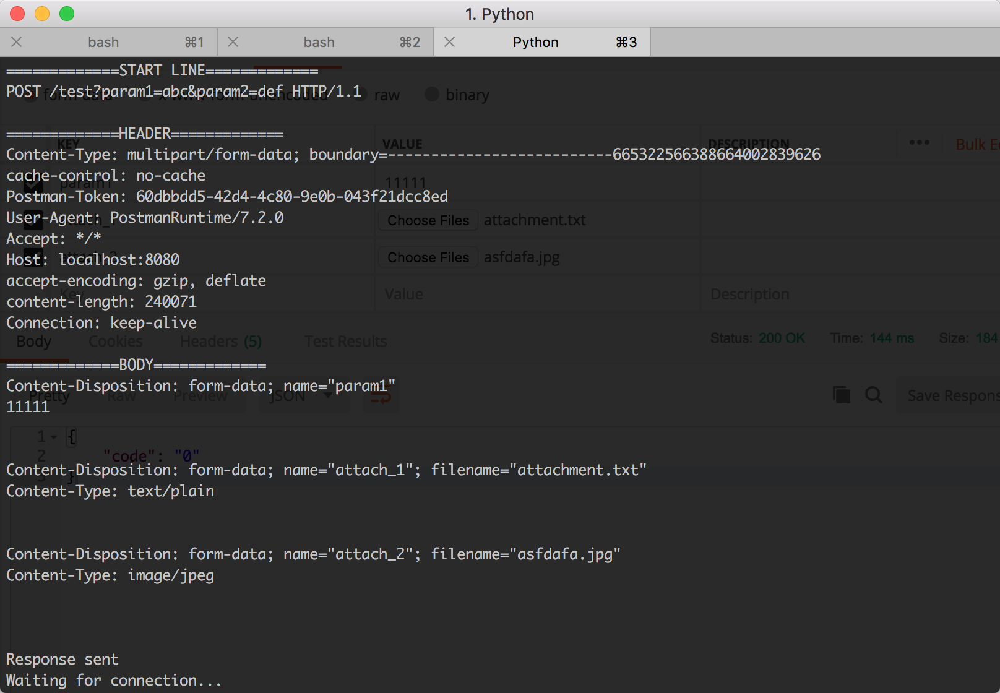

# simple_http_param_parser

目前是一个demo, 业余时间的side project, 用Python3写下的学习性质的HTTP1.1 parser入门引导, 目的是交流学习, 目前只支持GET, POST, PUT等有限的常用HTTP Method解析,往大了做的话就是HTTP服务器了(呵呵呵)
这仅仅是simple parser用于解析HTTP的结构以及参数等, 并不是HTTP协议的实现 (可以用在一些简单场景的调试, 比如利用Postman发起请求的时候, 可以查看服务端接收到的完整请求, 当然目前功能也不太完善, 时间精力允许的话我会慢慢改进.....)

HTTP协议请求(Request)分为3部分: 起始行(Start Line),首部(Header)以及实体主体(Body), 大致的解析原理是客户端请求进来后, 服务端读取请求的内容, 然后参照HTTP协议结构规范进行逐个部分解析,里头使用回车换行CRLF('\r\n','\r\n\r\n')进行分隔, 解析起来也是挺那啥的...... 
HTTP结构就分成3部分, 起始行跟首部就逐行解析, 至于Body就依赖于 Content-Type类型解析

好了, 执行 **python http_listener.py** 然后用Postman往8080端口发送请求就可以了

2018.9.8 Update
---
1. 把multipart/form-data上传的文件写成本地文件
2. 把 request 中的 parameters 补全

2018.9.25 Update
---
1. 补上 Transfer-Encoding: chunked 一般用做附件下载时使用(非定长的response body), 见 http_listener.py 中 response_chunked()函数 

e.g.
multipart/form-data
-----
一般上传文件会使用这个, 当然也可以传递普通的参数, Body部分会有  这样的“boundary=--------------------------665322566388664002839626”对多个参数进行分隔(普通的key value 参数以及附件可以同时存在)
因为相对其他 Content-Type 相对麻烦, 所以 parser中针对这种类型写了part文件帮助理解, 发起这种请求后, parser会把每个part的字节流写成 orig_multipart_xxx.txt文件(针对文件上传请自行将字节流,文件名自行写成附件), 这样可以清楚看到分割后每个part的结构

e.g.
application/x-www-form-urlencoded
-----
Body部分是 param1=111&param2=222...这样的格式传输

e.g.
application/json, text/plain...
-----
这一类的就直接将 Body 根据类型自行格式化, 转换就好了...

e.g.
Transfer-Encoding: chunked
-----
在无法确定Body长度的情况下(比如在附件下载的时候), 使用chunked方式对数据进行分块传输, 这样在收到最后一个size为0的时候即可得知数据传输已经完毕, 可以参考代码进行理解
在 Wireshark截图可以明了的看出 chunked 的分块结构

